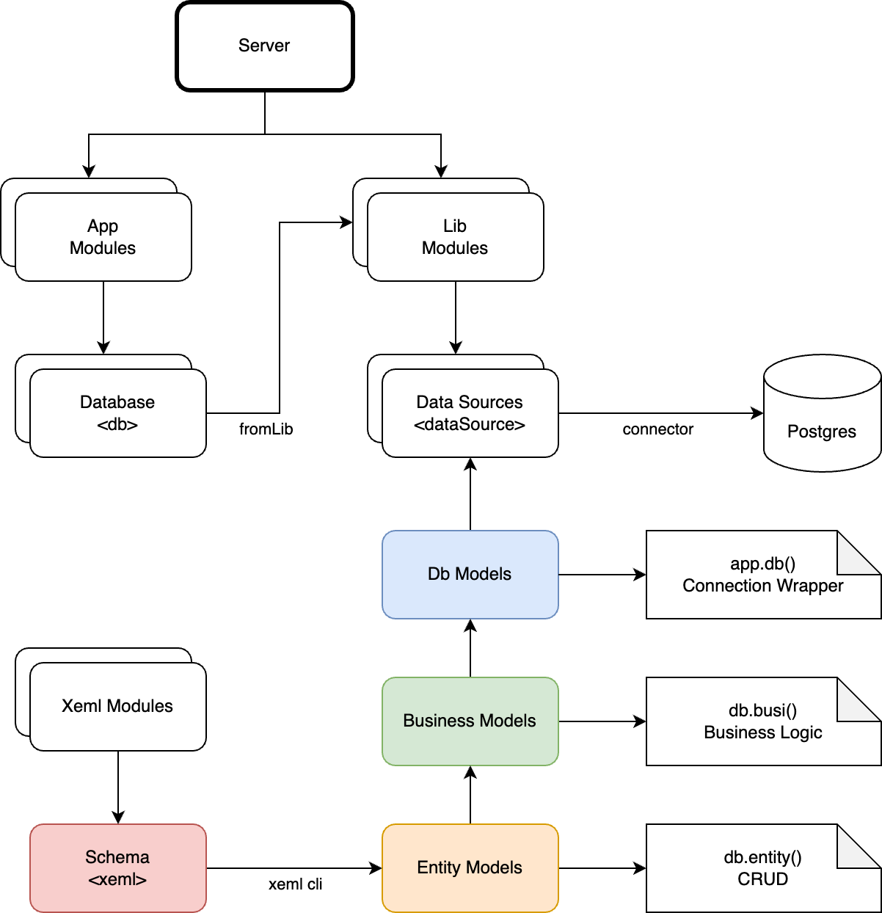

# Jacarana Data Access Models 

## Overview

This document outlines the design of the Jacarana Data Access Models for a Node.js backend system, focusing on the interaction between connectors, entity models, database models, and business logic classes. The architecture ensures a clean, extensible, and maintainable codebase, leveraging modern JavaScript features like async/await and Proxies.



## Base Components

1. **Connector**: Manages database connections and connection pools.
2. **DbModel**: Base class for database interactions, managing connections and transactions.
3. **EntityModel**: Base class for ORM entities, encapsulates data through a proxy.
4. **BusinessLogic**: Encapsulates the business logic of the system, interacting with one or more EntityModels and managing transactions.

Specific database features can be implemented in subclasses inheriting from the above base components.

E.g.

- **PostgresConnector**: Leverages `pg` package to manage connections and connection pools to PostgreSQL database.
- **PostgresEntityModel**: Supports special query syntax of PostgreSQL, e.g., `ANY`, `ALL`.
- **PostgresDbModel**: Supports multiple schemas inside a database.

## Connector

The `Connector` class is responsible for managing connections to the database.

### Interface

```javascript
class Connector {
  async connect_(); // Get a connection from the pool or create a new one, depending on the driver
  async disconnect_(); // Release the connection back to the pool or close it
  async end_(); // Close all connections in the pool
  async ping_(); // Ping the database
  async execute_(); // Execute a query
  async beginTransaction_(); // Begin a transaction
  async commit_(); // Commit a transaction
  async rollback_(); // Rollback a transaction
}
```

## EntityModel

The `EntityModel` class serves as a base class for data entities with static `meta` providing metadata. `EntityModel` instance itself does not save any data since JS always handles data in the form of JSON and it's not necessary to implement an ActiveRecord-like class.

### Interface

```javascript
class EntityModel {
  async findOne_(findOptions); // Implement find one logic
  async findMany_(findOptions); // Implement find many logic
  async findManyByPage_(findOptions, page, rowsPerPage) // Implement find many with pagination logic
  
  async create_(data, createOptions); // Implement create one logic
  async createFrom_(findOptions, columnMapping); // Implement create many from select logic

  async updateOne_(data, updateOptions); // Implement update one logic
  async updatemany_(data, updateOptions); // Implement update many logic

  async deleteOne_(deleteOptions); // Implement delete one logic
  async deleteMany_(deleteOptions); // Implement delete many logic
  async deleteAll_(deleteOptions); // Implement delete all logic

  getRelatedEntity(relationName); // Get related entity model by relation anchor.
  datasetSchema(datasetName); // Get a map of fields schema by predefined input set.
}
```

## DbModel

The `DbModel` class manages the lifecycle of a connection created from the connector, and all `EntityModel` instances are created from `DbModel`. `DbModel` uses Proxy to delegate PascalCase getter to the `entity(getterName)` method.

### Interface

```javascript
class DbModel {
  static meta;
  get driver();
  entity(name) {
    if (!this._cache[name]) {
      this._cache[name] = new meta.Entities[name](this);
    }
    return this._cache[name];
  }
  async transaction_(async function(anotherDbInstance));
  async retry_(transactionName, action_, onRetry_, payload, maxRetry, interval);
}
```

### Usage

- Get an entity and call entity interface

```javascript
const User = db.entity('User');
const user = await User.findOne_({ id: 1837 });
```

Note: for more information, please refer to [Data Library Manual](./data-manual.md)

## BusinessLogic

The `BusinessLogic` class encapsulates the business logic of the system. It interacts with one or more `EntityModel` instances and manages transactions to complete a business operation.

### Interface

```javascript
// ./business/auth.js
class AuthBusiness {
    async validate_(username, password) {
        const query = {};
        let loginBy = 'username';

        const [isEmail] = Validators.email(username);

        if (isEmail) {
            query.email = username.toLowerCase();
            loginBy = 'email';
        } else {
            query.mobile = Processors.normalizePhone(username);
            loginBy = 'mobile';
        }

        const AdminUser = this.db.entity('adminUser');
        const adminUser = await AdminUser.findOne_({
            $where: query,
        });

        //...
    }

    //...
}
export default AuthBusiness;
```

### Usage

- Business logic can be accessed throught `businessLogic` feature.

Enable `businessLogic` in the config.

```yaml
businessLogic:
    path: 'business'
```

- Use `bus()` function from `ctx` for request life-cycle tracking

```javascript
const auth = ctx.bus('auth' /*, schemaName, fromApp */);
await auth.validate_(...);
```

- Or use `bus` function from `app` instance for non-request business

```javascript
const auth = app.bus('auth' /*, schemaName, fromApp */);
await auth.validate_(...);
```

- Use business logic from other app

by app name
```js
const auth = ctx.bus('auth', null /* use default schema */, '@xxxx/yyy-auth-package');
await auth.validate_(...);
```

by app route
```js
const auth = ctx.bus('auth', null /* use default schema */, '/api/admin/v1'); // starting from '/'
await auth.validate_(...);
```

# Summary

This architecture provides a robust and flexible foundation for database access and management, supporting multiple database types and schemas, and enabling seamless integration of data operations with transaction management. The introduction of the BusinessLogic layer ensures that business operations are encapsulated, maintainable, and scalable. The use of async interfaces and proxies ensures modern, efficient, and maintainable code.