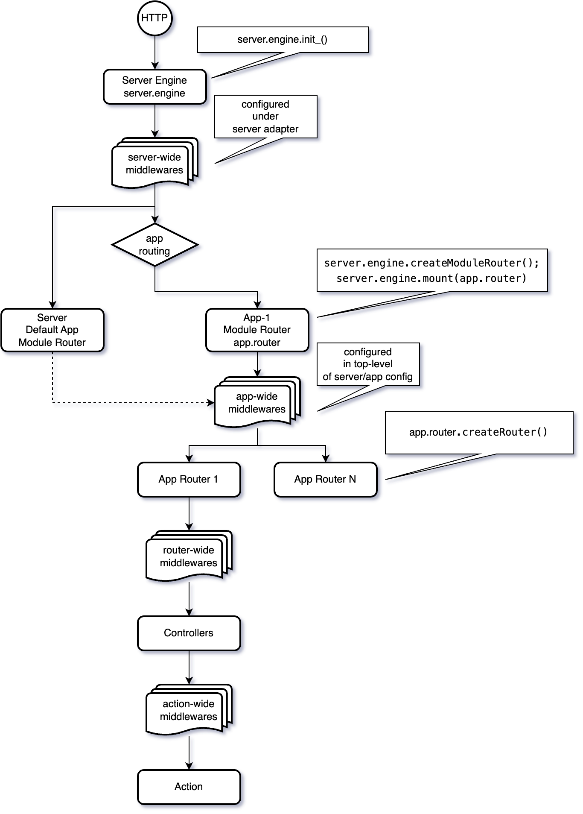

# @kitmi/jacaranda Server Routing

## Server & App 

A server hosts app modules and library modules.

### Request Handling Flow


### App Modules and Library Modules

- Library Module
    - Library module usually provide common business logic or common data access models for other app modules.
    - Library module does not provide external access interface.


- App Module  
    - App module usually has routing config to provide external access interface with certain kind of router.
    
Hereafter, `app` refers to an app module.

## Interoperbility

### Access lib from app

```js
app.host.getLib('<lib name>')
```

### Access app from another app

- by route

```js
// suppose the target app is mounted at /cms
app.host.getAppByRoute('/cms')
```
