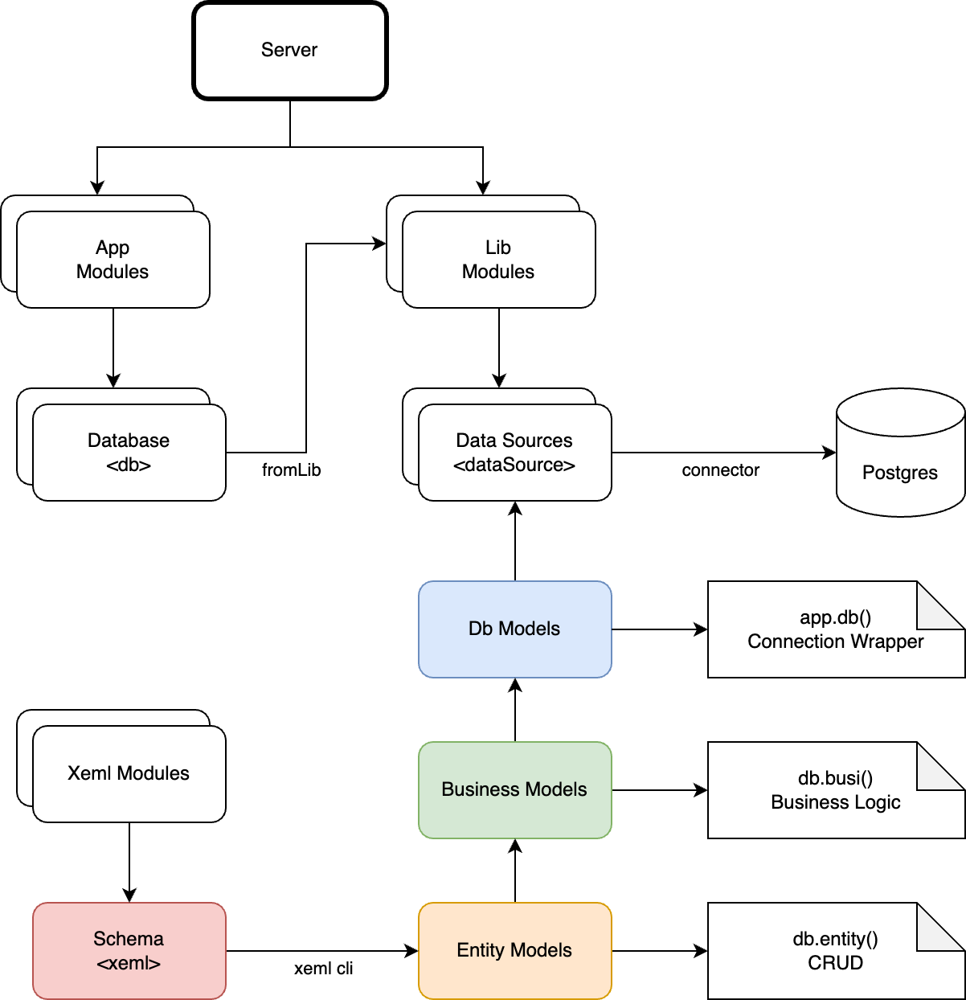

# Jacarana Data Access Models 

## Overview

This document outlines the design of the Jacarana Data Access Models for a Node.js backend system, focusing on the interaction between connectors, entity models, database models, and business logic classes. The architecture ensures a clean, extensible, and maintainable codebase, leveraging modern JavaScript features like async/await and Proxies.



## Base Components

1. **Connector**: Manages database connections and connection pools.
2. **DbModel**: Base class for database interactions, managing connections and transactions.
3. **EntityModel**: Base class for ORM entities, encapsulates data through a proxy.
4. **BusinessLogic**: Encapsulates the business logic of the system, interacting with one or more EntityModels and managing transactions.

Specific database features can be implemented in subclasses inheriting from the above base components.

E.g.

- **PostgresConnector**: Leverages `pg` package to manage connections and connection pools to PostgreSQL database.
- **PostgresEntityModel**: Supports special query syntax of PostgreSQL, e.g., `ANY`, `ALL`.
- **PostgresDbModel**: Supports multiple schemas inside a database.

## Connector

The `Connector` class is responsible for managing connections to the database.

### Interface

```js
class Connector {
  async connect_(); // Get a connection from the pool or create a new one, depending on the driver
  async disconnect_(); // Release the connection back to the pool or close it
  async end_(); // Close all connections in the pool
  async ping_(); // Ping the database
  async execute_(); // Execute a query
  async beginTransaction_(); // Begin a transaction
  async commit_(); // Commit a transaction
  async rollback_(); // Rollback a transaction

  async create_(model, data, options, connection) -> ({ data, affectedRows })
  async find_(model, options, connection) -> ({ data })
  async update_(model, data, options, connection) -> ({ data, affectedRows })
  async delete_(model, options, connection) -> ({ data, affectedRows })
}
```

## EntityModel

The `EntityModel` class serves as a base class for data entities with static `meta` providing metadata. `EntityModel` instance itself does not save any data since JS always handles data in the form of JSON and it's not necessary to implement an ActiveRecord-like class.

### Interface

```javascript
class EntityModel {
  async findOne_(criteria); // Implement find one logic
  async findMany_(criteria); // Implement find many logic
  async findAll_(); // Implement find all logic
  async createOne_(data); // Implement create one logic
  async createMany_(dataArray); // Implement create many logic
  async updateOne_(criteria, data); // Implement update one logic
  async deleteOne_(criteria); // Implement delete one logic
}
```

## DbModel

The `DbModel` class manages the lifecycle of a connection created from the connector, and all `EntityModel` instances are created from `DbModel`. `DbModel` uses Proxy to delegate PascalCase getter to the `entity(getterName)` method.

### Interface

```javascript
class DbModel {
  static meta;
  entity(name) {
    if (!this._cache[name]) {
      this._cache[name] = new meta.Entities[name](this);
    }
    return this._cache[name];
  }
  async transaction_(async function(anotherDbInstance));
}
```

## BusinessLogic

The `BusinessLogic` class encapsulates the business logic of the system. It interacts with one or more `EntityModel` instances and manages transactions to complete a business operation.

### Interface

```javascript
class BusinessLogic {
  async validateUserPassword() {
    // Example business operation logic
    await this.db.transaction_(async (db) => {
      const user = await db.entity('User').findOne_({ id: 1039 });
      await db.entity('UserProfile').updateOne_({ ref: user.ref }, { avatar: 'xxx' });
    });
  }

  // Other business logic methods
}
```

## Usage

- A default `DbModel` instance `db` can be retrieved from the Jacarana App instance.

```javascript
const db = app.db('db name');
const businessLogic = new BusinessLogic(db);
```

- For a normal query

```javascript
const User = db.entity('User');
const user = await User.findOne_({ id: 1837 });
```

- Transaction Management

```javascript
async function performTransaction() {
  await businessLogic.performOperation();
}
```

# Summary

This architecture provides a robust and flexible foundation for database access and management, supporting multiple database types and schemas, and enabling seamless integration of data operations with transaction management. The introduction of the BusinessLogic layer ensures that business operations are encapsulated, maintainable, and scalable. The use of async interfaces and proxies ensures modern, efficient, and maintainable code.